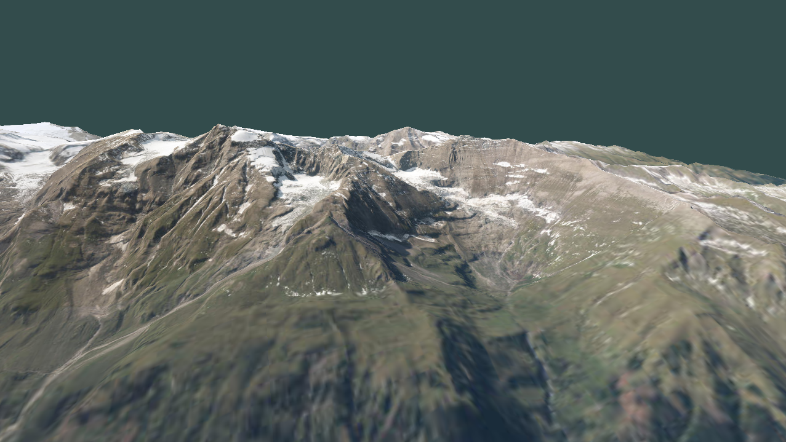

# Terrain Renderer


A simple OpenGL Terrain Renderer.



## Features

- [x] Real-world elevation and orthofoto data
- [x] Multithreaded terrain tile loading
- [X] Quadtree level-of-detail
- [X] Frustum Culling

## Build Instructions

This project depends on SDL2, GLM, GLEW and libcpr. You should be able to build by following the steps 
in the [cmake.yml](./.github/workflows/cmake.yml).

```
git clone --recursive git@github.com:gue-ni/TerrainRenderer.git
cmake -DCMAKE_BUILD_TYPE=Release -B build
cmake --build build --config Release --parallel
```
