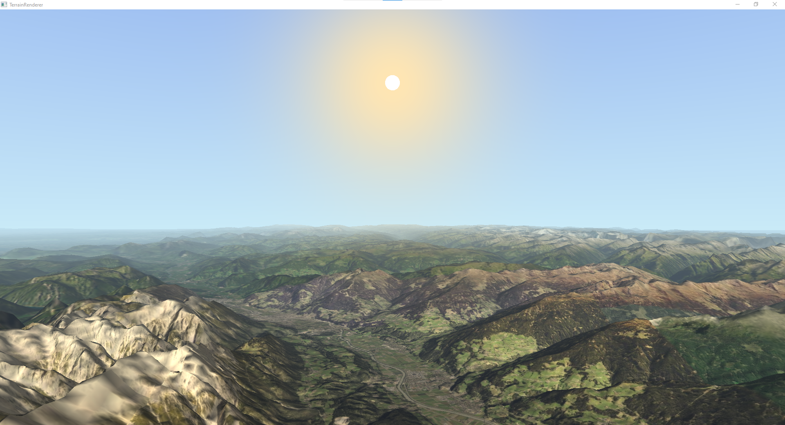

# Terrain Renderer


A simple OpenGL Terrain Renderer. Orthophoto data is provided by [basemap.at](https://basemap.at/), elevation data is from
[geoland.at](http://www.geoland.at/). This data is limited to Austria and as such only Austria is rendered.



## Features

- [x] Real-world elevation and orthofoto data
- [x] Multithreaded terrain tile loading
- [X] Quadtree level-of-detail
- [X] Frustum Culling
- [ ] Realistic Atmosphere with Rayleigh scattering

## Build Instructions

This project depends on [SDL2](https://www.libsdl.org/), [GLM](https://github.com/g-truc/glm),
[GLEW](https://glew.sourceforge.net/) and [libcpr](https://github.com/libcpr/cpr). You should be able to
build by following the steps in the [cmake.yml](./.github/workflows/cmake.yml).

```
git clone --recursive https://github.com/gue-ni/TerrainRenderer.git
cmake -DCMAKE_BUILD_TYPE=Release -B build
cmake --build build --config Release --parallel
```

## Digital Elevation Model

There are countless providers of satellite image tiles, but for the digital elevation model we have to provide the
data ourself. Download [ogd-10m-at.zip](https://gis.ktn.gv.at/OGD/Geographie_Planung/ogd-10m-at.zip) from
[data.gv.at](https://www.data.gv.at/katalog/dataset/b5de6975-417b-4320-afdb-eb2a9e2a1db).

Unzip the files and process the data with [gdal_translate](https://gdal.org/programs/gdal_translate.html) and [gdal2tiles.py](https://gdal.org/programs/gdal2tiles.html):

```bash
# convert from float32 to uint8 and scale values to [0, 255]
gdal_translate -ot Byte -scale 0 3795 0 255 dhm_at_lamb_10m_2018.tif grayscale-byte-fullsize.tif

# create tiles
gdal2tiles.py --resume --processes=2 --zoom=6-16 --tilesize=128 grayscale-byte-fullsize.tif tiles
```
